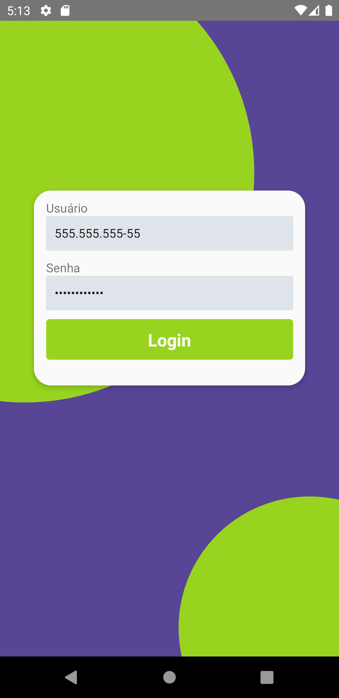
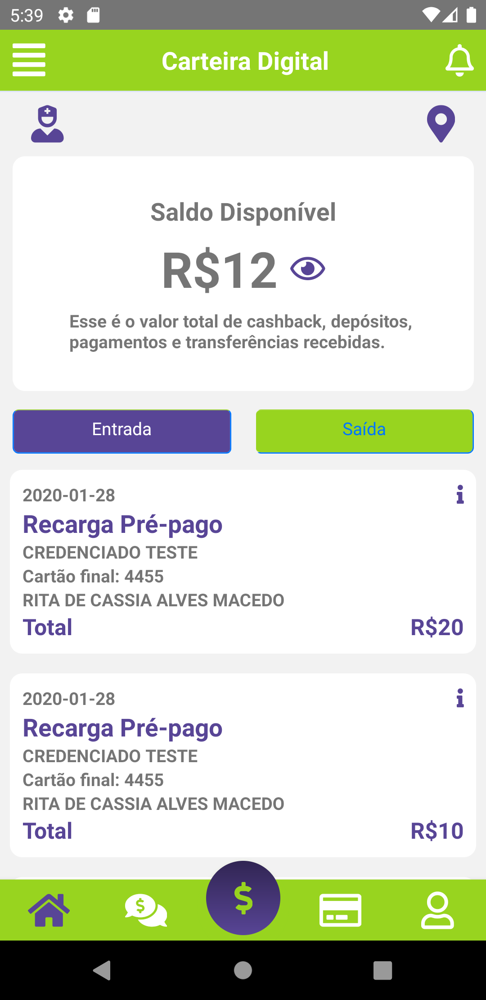

<h1 align="center">
	MAISTODOS - DESAFIO
</h1>


	
<h4 align="center">Aplicação mobile desenvolvida para consumir API's</h4>

<p align="center">
  <a href="#como-executar">Como executar</a> •
  <a href="#funcionalidades">Funcionalidades</a> •
  <a href="#a-desenvolver">A desenvolver</a>
</p>

## 🚀 Como executar
<ul>
  <li> fazer um clone do projeto para o seu computador </li>
  <li> no diretório raiz, executar **expo start** para iniciar a aplicação </li>
  <li> ou **yarn android | ios** para rodar a aplicação usando emulador </li>
</ul>

## 💬 Funcionalidades
<ul>
  - O app foi feito em React-Native
- Uso do Git
- Realização de micro commits que são muitos commits com menos código para ajudar a compreender a lógica
- Documentação detalhada de referencias/ferramentas que vc pesquisadas
- Criação de um repositório público e disponibilização do link para acompanhamento do desenvolvimento
</ul>

## 🔧 A desenvolver
<ul>
A MAISTodos precisa mostrar para os seus clientes o saldo disponível em suas respectivas MAISContas

Para isso foi feito um APP mobile bem simples, que mostra apenas as movitações da conta do cliente e o seu saldo

Para isso foi consultar=da a API de CC disponibilizada;

Para o login na aplicação, primeiro tem uma tela de input do username e senha;
O username deve tem uma validação de cpf (máscara) e depois envio para API;
</ul>

## 🔧 Documentação da API

API de Login
------------
- Não exite validação na api dos dados de login
- https://5efb30ac80d8170016f7613d.mockapi.io/api/mock/login
```json
{
  "username": "123",
  "password": "123"
}
```

```curl
curl --request POST \
  --url https://5efb30ac80d8170016f7613d.mockapi.io/api/mock/login --header 'Content-Type: application/json' --data '{
	"username": "a"
}'
```

API de saldo
------------
- saldo (float com o saldo)
- https://5efb30ac80d8170016f7613d.mockapi.io/api/mock/balance

```json
{
  "saldo": 12
}
```

```curl
curl --request GET \
  --url https://5efb30ac80d8170016f7613d.mockapi.io/api/mock/balance \
  --header 'Content-Type: application/json'
```

API de transações
-----------------

- tipoLancamento C para Crédito e D para Débito
- https://5efb30ac80d8170016f7613d.mockapi.io/api/mock/transactions


Resposta:
```json
[
    {
      "id": 1102,
      "descricao": "CREDENCIADO TESTE",
      "dataTransacao": "2020-01-28",
      "tipoTransacao": "Recarga Pré-pago ",
      "valorTransacao": 20,
      "tipoLancamento": "C",
      "cartaoMascarado": "600000******1234",
      "finalCartao": "1234",
      "nomePortador": "RITA DE CASSIA ALVES MACEDO "
    },
   ...
 ]
 ```
 
 ```curl
 curl --request GET \
  --url https://5efb30ac80d8170016f7613d.mockapi.io/api/mock/transactions \
  --header 'Content-Type: application/json'
 ```
 ## Atividades realizadas por partes
Parte 1
- instalação de dependências (nodejs, typescript, bibliotecas)

Parte 2
- criação da tela de login;
- componentes BalanceScreen e LoginScreen;

Parte 3 
- consumindo dados das api's;
- configuração dos dados para a primeira pagina;

Parte 4
- navegação entre rotas e estilização;
- ultimos ajustes visuais;

Parte 5
- disponibilização do codigo no GitHub

## Layout final

Login e senha
=====


Saldo + Transações
==================



